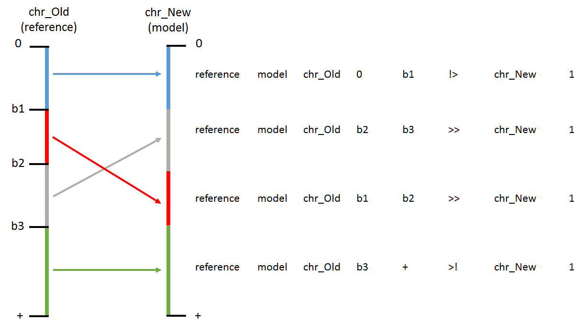

# Charm
**Ch**romosome re**ar**rangement **m**odeler.
Charm is a Python-based tool to simulate Hi-C-maps with user-defined chromosomal rearrangements. This tool allows to model CNVs, inversions, translocation, and extra-chromosomal fragments.

## Requirements
1) Python >= 3.7 with NumPy
2) [Juicer Tools](https://github.com/aidenlab/juicer) (for dumping the contacts from the existing .hic-files and/or creating the new .hic-files)
3) Java (the Juicer Tools requirement)
4) the generation of database from Hi-C map with 600 billion contacts requires around 48-60Gb RAM and 9 hours of real time
5) the simulation of rearrangement for one chromosome pair from given database requires around 6-24Gb RAM and 1-2 hours of real time
## Test dataset run
```
python3 charm.py -i testdataset/EXAMPLE.ini
```
As ending, the Charm creates in "testdataset" folder "out" containing the Hi-C file with simulated rearrangement named "example.cnv-X.hic"

# Quick Start

1) Create your file with the description of rearrangements (see [The SVs description](#the-svs-description))
2) Duplicate [EXAMPLE.ini file](EXAMPLE.ini) and modify:
  * [global] section:
    - "work_dir" - the path to your working (output) directory;
    - "chrom_sizes" - the path to the file with [the chromosome sizes](#the-chromosome-sizes-file) of reference genome;
    - "contact_count" - the desired sum of contacts for a simulated Hi-C map;
    - "heterozygous" - "YES" if *all* rearrengments are heterozygous; "NO" if *all* rearrengments are homozygous;
    - "one_as_null" - if "YES" contacts == 1 are processed as 0 \("YES" should be used for the whole genomic Hi-C, and "NO" should be used for the enriched Hi-C, like promoter-capture\);
    - "reference_id" - the preferred name of the database.
  * [preprocessing] section
    - "path_to_hic" - the path to the reference hic-file;
  * [SVs] section
    - "path_to_svs_list" - the path to your file with the [description of rearrangments](#the-svs-description);
    - "simulation_id" - the unique id of simulated rearrangement from your file with the description of rearrangements;
  * [simulation] section
    - "predict_null_contacts" - describes how to predict contact count if the reference value is 0. Use "cov_sq_f1" for whole genomic Hi-C, "cov_mixsq_f1" for enriched Hi-C. Other options ("cov_mult_f"/"cov_sq_f"/"cov_mult_f1"/ for whole-genome data and "cov_mixed_f"/ "cov_mixsq_f" / "cov_mixed_f1" for enrichment) are experimental.
  * [hic]
    - "format" - output file format: "hic" for juicer tools hic-map, "pre" for the [pre-file](https://github.com/aidenlab/juicer/wiki/Pre#short-with-score-format);
      "short" for the [extra short](https://github.com/aidenlab/juicer/wiki/Pre#extra-short-format-dev) pre-file;
      "pre.gz" and "short.gz" - the gzipped output;
    - "hic_resolutions" - the list of Hi-C map bin sizes; the minimal bin size must be equal to [global] "resolution" or higher;
3) run
```
python3 charm.py -i YOUR-INI-FILE.ini
```
4) the result will be placed in the folder **[global:work_dir]/out** . The name of the output file will be **[hic:simulation_id].[hic:format]** .
5) the database with statistics of reference Hi-C map will be placed in the folder **[global:work_dir]/pre/[global:reference_id]/** .
6) the pseudo replicas will be placed in the folder **[global:work_dir]/wt/[global:reference_id].[simulation:predict_null_contacts]/[simulation:contact_counts]/[wt:replicas_ids]/** .

## Example tasks

Charm includes several steps. If your task requires simulating many independent rearrangements, split it into subtasks as shown in the examples below and in a 
detailed [guide](#simulation-of-the-structural-variant-a-step-by-step-guide).

### 1) Generating reference database without consequent simulations:
```
python3 charm.py -i testdataset/EXAMPLE.ini -S pre
```
or
```
python3 charm.py -i testdataset/example_PRE.ini
```
As a result, the Charm creates in "testdataset" the folder "pre/TEST" with: 

- the files "TEST.5000.stat", "TEST.5000.binCov" and the folder "TEST.5000" containing files "TEST.5000.{chr1}.{chr2}.allCon"

- the files "TEST.50000.stat", "TEST.50000.binCov" and the folder "TEST.50000" containing files "TEST.50000.{chr1}.{chr2}.allCon"

- the files "pab.TEST.{resolution_pab}.stat", "pab.TEST.{resolution_pab}.binCov" and the folder "pab.TEST.{resolution_pab}" containing files "pab.TEST.{resolution_pab}.{chr1}.{chr2}.allCon"

where {chr1} and {chr2} are the chromosome names and {resolution_pab} is the resolution from [global] section, "resolution_pab" key.

### 2) Generating a database of randomized wild-type contacts, a.k.a. pseudoreplicates (AFTER the reference database was generated):
```
python3 charm.py -i testdataset/EXAMPLE.ini -S wt
```
or
```
python3 charm.py -i testdataset/example_WT.ini
```
As a result, the Charm creates in "testdataset" the folders "wt/TEST.cov_mult_f1/841160/0/" with files named like "TEST.cov_mult_f1.0.{chr1}.{chr2}.allCon" and the folders "wt/TEST.cov_mult_f1/841160/1/" with files named like "TEST.cov_mult_f1.1.{chr1}.{chr2}.allCon"

### 3) Simulation of *heterozygous* mutation (AFTER the reference database and the pseudoreplicates were generated):
```
python3 charm.py -i testdataset/example_HETEROZYGOUS.ini -S SVs+
```
As a result, the Charm creates in "testdataset" the folder "out" containing the Hi-C file with simulated rearrangement named "heterozygous.del.hic"

### 4) Simulation of *homozygous* mutation (AFTER the reference database and the pseudoreplicates were generated):
```
python3 charm.py -i testdataset/example_HOMOZYGOUS.ini -S SVs+
```
As a result, the Charm creates in "testdataset" the folder "out" containing the Hi-C file with simulated rearrangement named "homozygous.del.hic"

### 5) Simulation of hic-file based on non-reference (*mutant*) genome (AFTER the reference database was generated):
```
python3 charm.py -i testdataset/example_MUTANT.ini -S SVs+
```
As a result, the Charm creates in "testdataset" the folder "out" containing the Hi-C file with simulated rearrangement named "in_mut.cnv-X.hic".
This hic-file will contain the new chromosome "1x".

### 6) Building of wild-type hic-file (AFTER the reference database and the pseudoreplicates were generated):
```
python3 charm.py -i testdataset/example_REPLICAS.ini -S hic
```
As a result, the Charm creates in "testdataset" the folder "out" containing the hic-file with simulated rearrangement named "replicas.TEST.cov_mult_f1.hic".

## Simulation of the structural variant: a step-by-step guide.
If your task requires simulating many independent rearrangements, split it into several subtasks.

**The first step**: the generation of a reference database.
1) Copy the [EXAMPLE.ini](testdataset/EXAMPLE.ini) and modify:
   * [global] section:
     - "work_dir" - the path to your work directory;
     - "chrom_sizes" - the path to the file with [the chromosome sizes](#the-chromosome-sizes-file) of reference genome;
     - "one_as_null" - if "YES" contacts == 1 are processed as 0 \("YES" should be used for the whole genomic Hi-C, and "YES" should be used for the enriched Hi-C, like promoter-capture\);
     - "reference_id" - the preferred reference name used to build the database; 
   * [preprocessing] section
     - "path_to_hic" - the path to your hic-file;
2) run
```
python3 charm.py -i your-pre.ini -S pre
```
The database with statistics of reference Hi-C map will be placed in the folder **[global:work_dir]/pre/[global:reference_id]/** .

**The second step**: the generation of pseudoreplicates (only required for heterozygous rearrangements)

1) Copy the [example_REPLICAS.ini](testdataset/example_REPLICAS.ini) and modify:
   * [global] and [preprocessing] sections - past the values from the ini-file created in the first step;
   * [simulation]
     - predict_null_contacts - describes how to predict contact count if the reference value is 0. Use "cov_sq_f1" for whole genomic Hi-C, "cov_mixsq_f1" for enriched Hi-C. Other options ("cov_mult_f"/"cov_sq_f"/"cov_mult_f1"/ for whole-genome data and "cov_mixed_f"/ "cov_mixsq_f" / "cov_mixed_f1" for enrichment) are experimental.
     - contact_count - the desired sum of contacts for a simulated Hi-C map;
   * [wild_type]
      - replica_ids - the list of any labels that will be used as unique ids of pseudo-replicas, i.e. 1,2,3
2) run
```
python3 charm.py -i your-replicas.ini -S wt
```
3) the pseudo replicas will be placed in the folder **[global:work_dir]/wt/[global:reference_id].[simulation:predict_null_contacts]/[simulation:contact_counts]/[wt:replicas_ids]/** .

**The third step**: the rearrangements simulation.
1) Create your file with the description of rearrangements (see [The SVs description](#the-svs-description))
2) Copy the [example_HETEROZYGOUS.ini](testdataset/example_HETEROZYGOUS.ini) or [example_HOMOZYGOUS.ini](testdataset/example_HOMOZYGOUS.ini) and modify:
   * [global], [simulation], and [preprocessing] sections - past the values from the ini-file created in the second step;
   * [SVs] section
     - "path_to_svs_list" - the path to your file with the description of rearrangements;
     - "simulation_id" - the unique id of simulated rearrangement from your file containing the description of rearrangements;
   * [wild_type]
     - replica_ids - use any TWO values from the ini-file created in the second step;
3) run
```
python3 charm.py -i your-simulation.ini -S SVs+
```
4) The result will be placed in the folder **[global:work_dir]/out** . The name of the resulting file will be **[hic:simulation_id].[hic:format]** .
5) Repeat this step for every independent simulation.

### The chromosome sizes file
This file contains chromosome sizes ([example](testdataset/data/test.chrom.sizes)). The chromosome names and chromosome sizes must correspond to the chromosome sizes and chromosome names in .hic-file. 
File format (see the example "test.chr.sizes")
```
<chromosome name> <chromosome size bp>
```

### The SVs description 
To simulate SVs, Charm requires the file with a description of rearrangement. In the file, one should describe _derivative_ chromosomes only. Derivative chromosomes are described as chains of consecutive segments originating from reference chromosomes. To better understand this description, imagine modeling of contacts involved in chromosomal rearrangement as follows:

1) for each segment of the _derivative_ chromosome, the contacts of the reference chromosome containing this segment are set to zero (in the case of homozygote modeling) or reduced by half (in the case of heterozygote modeling). **Attention!** It does not matter how small the segment of the derivative chromosome is - all contacts of the corresponding reference chromosome are removed.
2) contacts of all segments in the _derivative_ chromosomes are modeled and added to the Hi-C map.


The file describing rearrangments must include the following columns (also see the example "test.svs_list.txt" in the testdataset folder):
```
<reference_id> <simulation_id> <chromosome_name> <block_start> <block_end> <indicator> <new_chromosome_name> <copy_number>
```


The \<reference_id\> and  the \<simulation id\> are any names corresponding to the ini file records "reference_id" and "simulation_id". Every model must be named uniquely. 

The \<chromosome_name\> is the name of the reference genome chromosome involved in the rearrangement.

The \<block_start\> and the\<block_end\> are the coordinates of breakpoints in the reference genome. The "+" should be used in \<block_end\> column as the symbol of the chromosome end.

The \<indicator\> variants:
  - Use "!>" for the start of the simulation description, i.e. first line where a particular simulation_id occurred should be indicated by this sign;
  - Use ">>" for the continuation of simulation description;
  - Use ">!" for the end of the simulation description, i.e. last line where the particular simulation_id occurred should be indicated by this sign.
All lines between "!>" and ">!" are processed by Charm as one simulation and can include several independent rearrangements, but all rearrangements must have the same \<simulation_id\>.

The \<new_chromosome_name\> is the name of the simulated derivative chromosome resulting from the rearrangement. This name can be the same as \<chromosome_name\> or, better, be novel. 

The value in \<copy_number\> indicates both the number of copies and genomic orientation of the segment and can be any integer; the negative values correspond to the inverted orientation (see example #2); the "0" corresponds to the deletion (example #3). **Attention!** If \<copy_number\> is more than 1, or less than -1, the rearrangement will be simulated as *tandem*, head-to-tail, CNV (example #4). In other cases, describe every repeated loci by the new line (example 5).   

Examples:

*(1)* A simple insertion; the locus 1Mb-2Mb of chromsome 1 is inseted at position 7Mb of the same chromsome:
```
test	trn	chr1	0		1000000	!>	der1	1
test	trn	chr1	2000000	7000000	>>	der1	1
test	trn	chr1	1000000	2000000	>>	der1	1
test	trn	chr1	7000000	+		>!	der1	1
```
*(2)* An inversion of locus chr1:1Mb-2Mb
```
test	inv	chr1	0		1000000	!>	der1	1
test	inv	chr1	1000000	2000000	>>	der1	-1
test	inv	chr1	2000000	+		>!	der1	1
```
*(3)* An deletion of locus chr1:1Mb-2Mb
```
test	del	chr1	0		1000000	!>	der1	1
test	del	chr1	1000000	2000000	>>	der1	0
test	del	chr1	2000000	+		>!	der1	1
```
*(4)* An tandem duplication of locus chr1:1Mb-2Mb
```
test	dups	chr1	0		1000000	!>	der1	1
test	dups	chr1	1000000	2000000	>>	der1	2
test	dups	chr1	2000000	+		>!	der1	1
```
*(5)* An head-to-head duplication of locus 1:1Mb-2Mb
```
test	dups	chr1	0		1000000	!>	der1	1
test	dups	chr1	1000000	2000000	>>	der1	1
test	dups	chr1	1000000	2000000	>>	der1	-1
test	dups	chr1	2000000	+		>!	der1	1
```
*(6)* A loss of chromosome 1 segment starting from 5Mb untill the end of the chromsome 
```
test	del	chr1	0	5000000	->	der1	1
```
*(7)* An unbalanced translocation of the locus chr1:1Mb-2Mb. Ten copies of this locus is inserted in the end of the chromosome 1
```
test	trnx10	chr1	0		+		!>	der1	1
test	trnx10	chr1	1000000	2000000	>!	der1	10
```
*(8)* An insertion of the locus chr1:1Mb-2Mb to the chromosome 2:7Mb:
```
test	trn	chr1	0		1000000	!>	der1	1
test	trn	chr1	2000000	+		>>	der1	1
test	trn	chr2	0		700000	>>	der2	1
test	trn	chr1	1000000	2000000	>>	der2	1
test	trn	chr2	7000000	+		>!	der2	1
```

*(9)* A complex rearrangement: creating new derivative chromosome from locus chr1:1Mb-2Mb (3 copy), a locus chr1:3Mb-4Mb (3 copy in the inverted orientation), a locus chr1:5Mb-7.5Mb. Chromosome 1 is saved intact.

_Note: here we would like to create a derivative chromosome containing a segment from chromosome 1, yet we want to keep **all** contacts of chromosome 1. Since creating a derivative chromosome with the segment of chr1 will remove contacts of the original chr1, we will create one more derivative chromosome where we 'copy' complete chromosome 1. As a result, on the chr1 Hi-C map, we expect to see all reference contacts of this chromosome + modeled contacts of the derivative chromosome segment._

```
test	compX	chr1	0		+		!>	der1	1
test	compX	chr1	1000000	2000000	>>	chrNew	3
test	compX	chr1	3000000	4000000	>>	chrNew	-3
test	compX	chr1	5000000	7500000	>!	chrNew	5
```
*(10)* Several rearrangements: a translocation from chromosome 1:1Mb-2Mb to 2:7Mb, tandem duplication of 1:7Mb-8Mb and deletion of 2:1Mb-2Mb
```
test	several	chr1	0		1000000	!>	der1	1
test	several	chr1	2000000	7000000	>>	der1	1
test	several	chr1	7000000	8000000	>>	der1	2
test	several	chr1	8000000	+		>>	der1	1
test	several	chr2	0		1000000	>>	der2	1
test	several	chr2	1000000	2000000	>>	der2	0
test	several	chr2	2000000	7000000	>>	der2	0
test	several	chr1	2000000	7000000	>>	der2	1
test	several	chr2	7000000	+		>!	der2	1
```

## Advanced description
charm [-i ini_file] [-S stage] 
* [ini_file]: the path to ini-file containing paths to the working directory, hic-file, unique SV id(s), model parameters, and others. See the full ini-file description in the [BIG_EXAMPLE.ini](BIG_EXAMPLE.ini). See the common description of ini-file in the python module [confiparser](https://docs.python.org/3/library/configparser.html), class configparser.ExtendedInterpolation.
* [stage]: optional, must be one of "pre+","SVs+","sim+","lift+","wt+","hic" (default "pre+")
  - "pre+" is the default parameter, from hic-file with the wild-type data to hic-file with simulated SVs
  - Use "SVs+" when the database with contact statistics exists, but the file with rearrangement description has not yet been created 
  - Use "sim+" when the rearrangement description and database are done, but the contacts of the mutant genome have not yet been simulated
  - Use "lift+" when the contacts of the mutant genome are simulated ("in_mut.[simulation_id]" files created), but these contacts are not yet lifted on the reference genome
  - Use "wt+" when the simulation is fully processed ("in_ref.[simulation_id]" created), but wild-type replicas are not
  - Use "hic" when all previous stages are successfully completed, but .hic-file is not created
* advanced settings for [stage]:
  - Use "pre" to create the database with contact statistics only
  - Use "SVs" to create the rearrangement description files only; in this mode, Charm can process the file containing any number of independent SVs 
  - Use "sim" to only simulate contacts within *mutated* genome based on the provided database
  - Use "lift" to liftover contacts from the provided defined mutant genome
  - Use "wt" to simulate wild-type replicas
